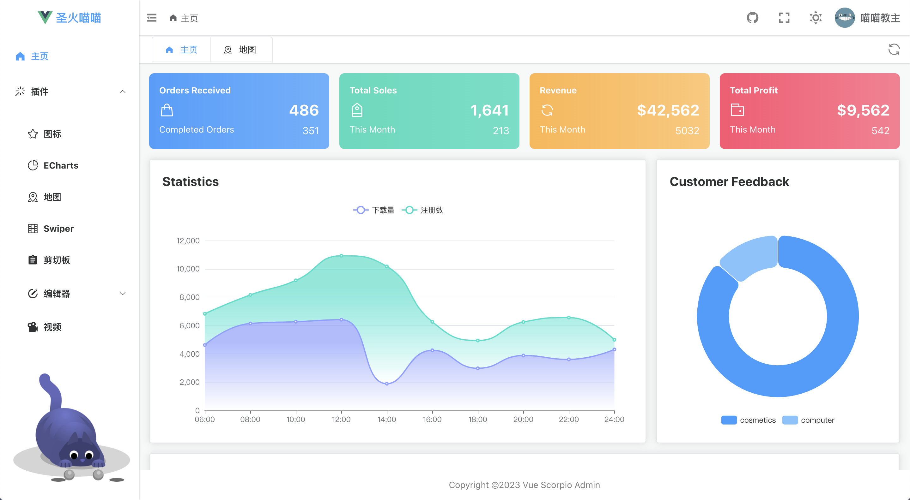

# vue-scorpio-admin

- 基于 Vue3、Vite、TypeScript、Pinia、Unocss、Element-plus 等新框架或新工具开发
- TypeScript 类型系统覆盖率高，已覆盖日常大部分开发场景
- 引入 unplugin-auto-import、unplugin-vue-components 实现 API 和组件的自动按需导入，大大减少导入语句代码量
- 引入 unplugin-icons 工具，搭配 [iconify](https://icon-sets.iconify.design/) 自动按需引入图标
- Unocss 原子化 CSS 解决方案，搭配 [链接](https://unocss.dev/interactive/) 使用极佳
- eslint + husky + stylelint + lint-staged 保证代码风格一致和提交信息规范

## Project Setup

### Install

```bash
npm install
```

### Compile and Hot-Reload for Development

```bash
npm run dev
```

### Type-Check，Compile and Build for Production

```bash
npm run build
```

## Preview

